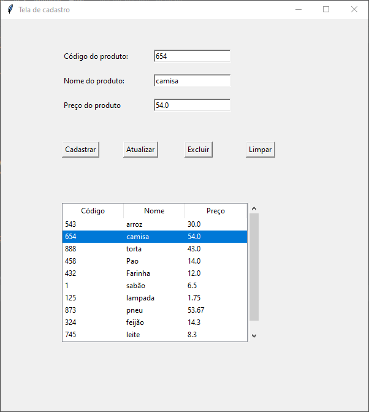

# Items Database with Tkinter

Esse projeto, desenvolvido em Python, tinha como objetivo registrar itens de um supermercado em um banco de dados.

O gerenciador de banco de dados que foi utilizado foi o PostgreSQL e foi utilizada uma interface gráfica para uma melhor interação com o banco.

 
